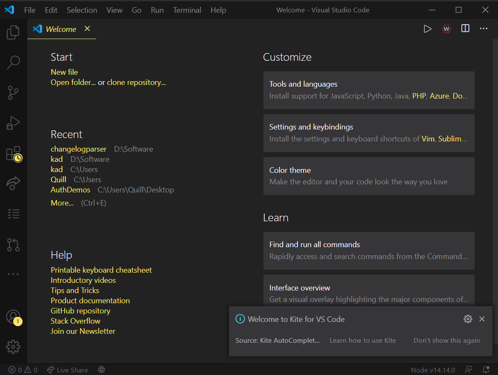
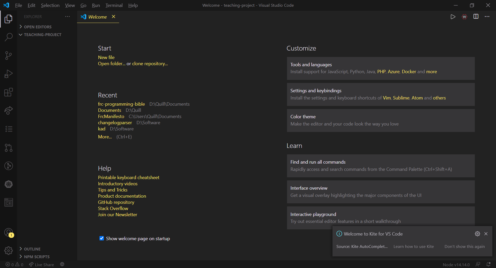
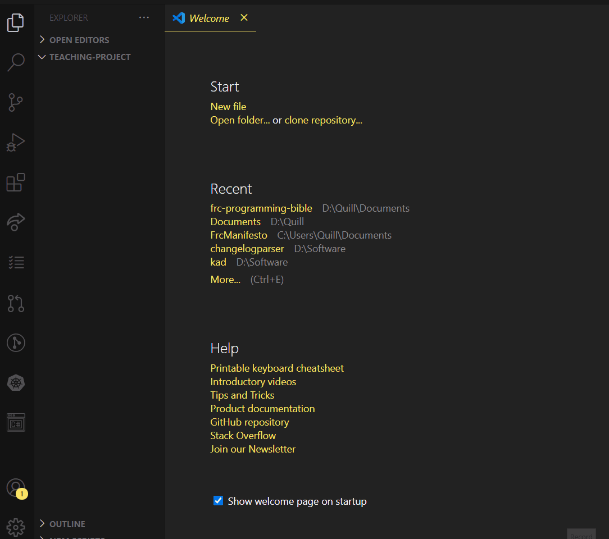

#  Puroguramingumonogatari
>NOTE: THIS IS A WIP DOCUMENT!

AKA: A noobs guide to programming
## Table of Contents
### For Complete Beginners
- [Setup For Noobs](#setup-for-noobs)
### Just jump straight to java please
- [Starting with java](#starting-with-java)
### I'm already a pro but Pinkston/Jones  showed me this anyway
- [Hackermans](#im-a-pro)
## An introduction.
Hey you, yeah you. You think you know something about programming? Good, you'll probably be useful, but you have a long path to follow little one. Don't know a thing? Well then the goal of this little document is to get you from knowing nothing, to writing useful programs for FIRST Robotics, and preparing you for a future in writing software.
## For those who know nothing, Start here!
### How do I start mysterious man of the past?
In my opinion the easiest way to learn programming is by doing, what have you always thought would be cool in programming? What sounds cool? What looks cool? Is it too difficult? This way of thinking will eventually drive you into a project, and participating in such projects will make you a batter overall programmer.
### But mysterious man of the past, I'm not creative.
Well fear not, as a programmer creativity can come later. So for a start we'll be looking at javascript, and we'll later move into java for actual robot code. The reason we start in javascript is because it's easier to understand, easy to setup, and translates well into Java code.
>Q: What's a Javascript mysterious man?
>A: Javascript is a high level (easy to write) scripting language mainly used for web/server development.
>Q: What's a Java mysterious man?
>A: Javas is a high level object oriented (we put code into little boxes called objects that break up hard to understand things) programming language that is commonly used for desktop applications, and sometimes web apps.
## Setup for noobs
### Okay okay mysterious man, how do I get started 
Well for starting with javascript there's this cool thing called Node.JS and NPM. Node.js is a way to write javascript code on the desktop and it makes it more similar to Java. NPM is a way to download libraries (other peoples code that we can openly use to make our lives easier)
#### NPM Download/Setup
[Official Guide](https://docs.npmjs.com/downloading-and-installing-node-js-and-npm)
[Node.JS/NPM Download ](https://nodejs.org/en/download/)
#### Cool now you have NPM, let's get an IDE
> Q: What's an IDE?
> A: IDE stands for Integrated Development Environment, aka a nice place to write code
> Take this wiki page if you don't get it [Boom.](https://en.wikipedia.org/wiki/Integrated_development_environment)
#### For our guide we'll be using VSCode for 2 reasons
* A: I am already intimately familiar with it, and it's pretty nice
* B: It is currently the standard IDE for First Robotics usage.

Download VSCode [HERE!](https://code.visualstudio.com/)
#### By the way.
If you're a security dork, don't worry all of the projects linked in this document are *OPEN SOURCE* meaning you can look at the source code yourself if you really want. If that's not enough... you might have bigger issues. Here are the repository URLS for [VSCode](https://github.com/microsoft/vscode)/[Node.js](https://github.com/nodejs/node)/[NPM](https://github.com/npm/cli).
If you're a real beginner, please don't worry about this. Build season is too short and if you trust me, the mysterious man of the past, you'll be fine!
#### Okay now that all that's setup , let's open VSCode!

When you first open VSCode it should look somewhat like this, probably not exactly like this however because I have a custom theme (Monokai Pro Spectrum if you're curious..)
#### Let's Create our first project!
To create our first project we're going want to select a folder to work in, we can select a folder my clicking "File" in the top left then clicking "Open Folder" and creating a folder to work in
> File>Open Folder>[Select a folder to work in.]

After doing that your screen should look something like this

Now we need to create the JS file we'll be working with, to do this right click the area on the left, and click "New File" and name it app.js

## Starting with Java
 
## Im a pro
:clap: :clap: :clap: 
Wow, you're the best, I love you, everyone loves you. If you're a pro then go ahead and just look at some of my previous code for robotics to get the jist of what's going on in the scene of robotics, Here's some important links from me.
>Q: Why are some of these in C++ in the earlier years?
>A: I like C++ but Java is easier to teach & write, so we use Java!
>Q: Why is there code from FRC7265 & FRC6214?
>A: I was on both teams!
### Imporant Links:
* [My GitHub](https://github.com/QuillDev)
* [WPILib Docs](https://docs.wpilib.org/en/stable/)
* [QuillFRC (Java)](https://github.com/QuillDev/QuillFRC)
* [7265 2021 Code (Java)](https://github.com/QuillDev/FRC-2021)
* [7265 2020 Code (Java)](https://github.com/QuillDev/FRC-2020-Code-Release)
* [7265 2019 Code (C++)](https://github.com/QuillDev/SkeleThor)
* [6214 2019 Code (C++)](https://github.com/6214frc/Wrench)
* [7265 2018 Code (C++)](https://github.com/QuillDev/FIRST-Power-UP-2018)
* [6214 2018 Code (C++)](https://github.com/6214frc/20186214)

